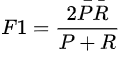
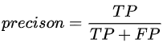
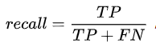

# CS224N 笔记（十）：问答系统

## 引言

问答系统（QA）实际需求很多，比如我们常用的谷歌搜索就可看做是问答系统。

## 类别

问答系统看做两部分：
1. 从海量的文件中，找到与问题相关的可能包含回答的文件，这一过程是传统的information retrieval；
2. 从文件或段落中找到相关的答案，这一过程也被称作Reading Comprehension阅读理解，也是这一讲关注的重点。

## 常用数据集

### SQuAD

Reading Comprehension需要数据是Passage即文字段落，Question问题以及相应的Answer回答。SQuAD(Stanford Question Answering Dataset)就是这样的数据集。

### 评价指标

对于每个问题都有人类提供的三个标准答案，为了评估问答模型，有两个metric：

1. Exact match：即模型回答与任意一个标准答案匹配即计数为1，否则为零。统计整体的准确率；
2. F1 score：即将模型答案与标准答案当做bag of words，计算公式：

    

    其中：

    

    